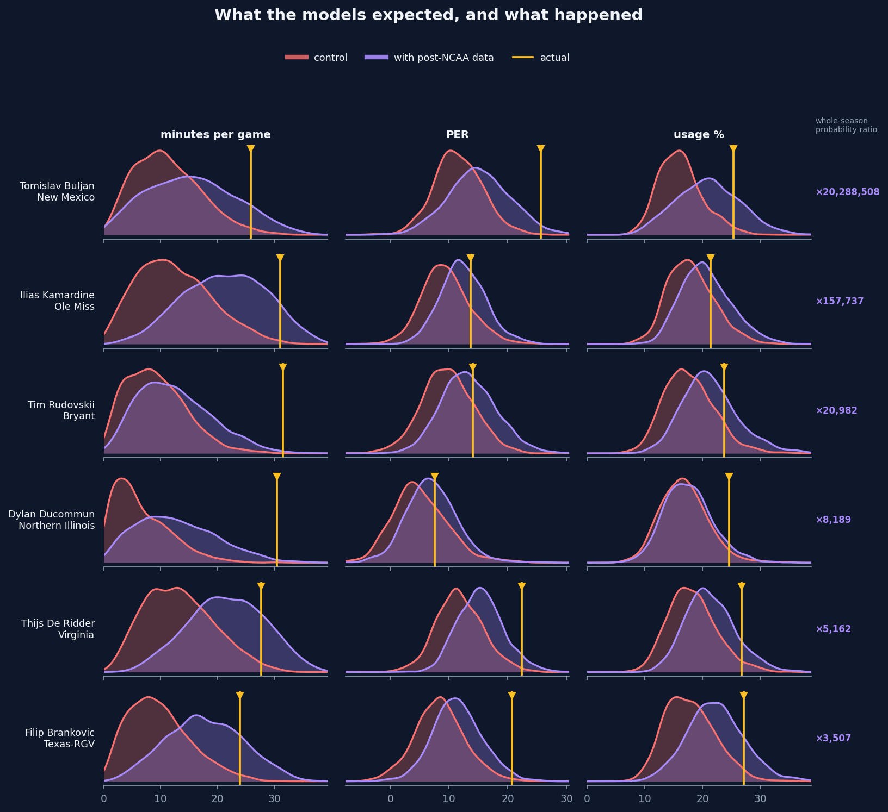
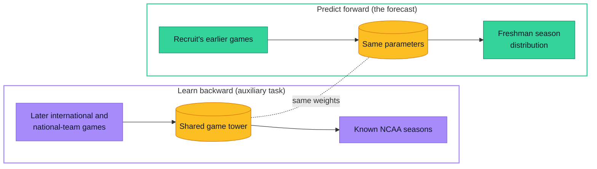
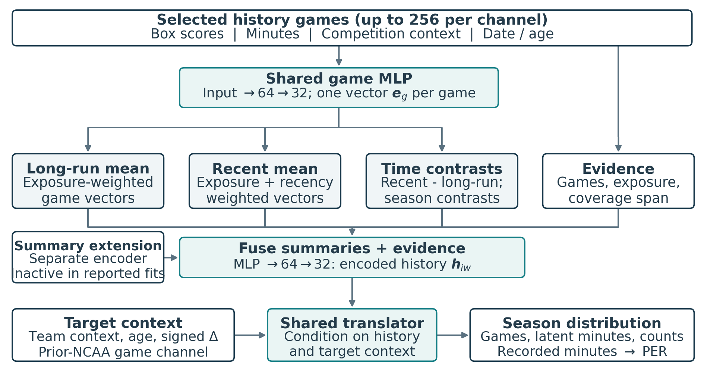
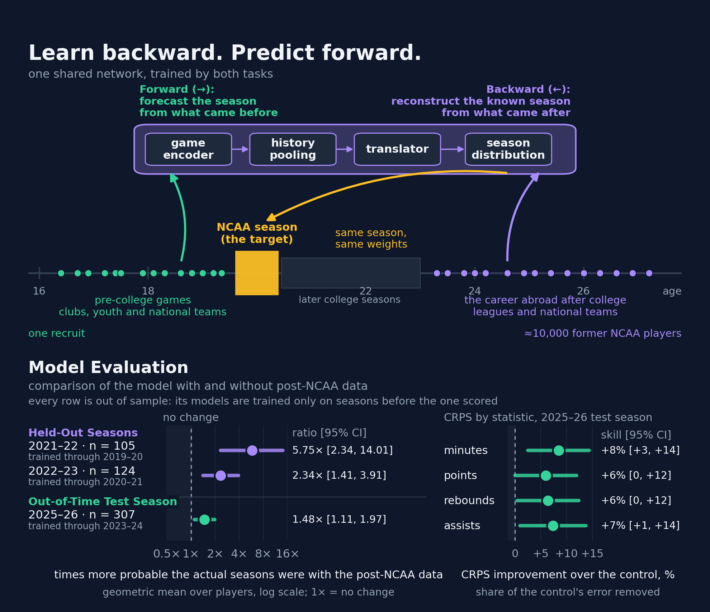
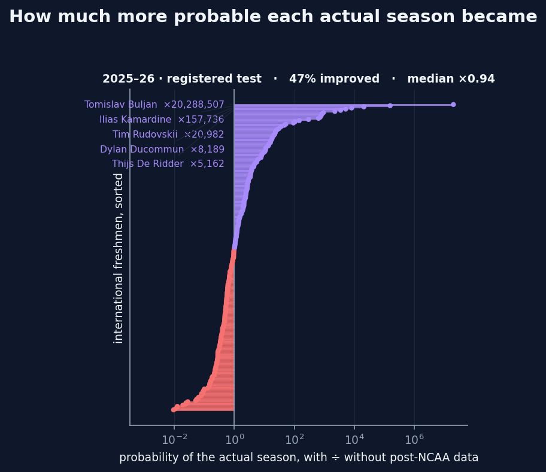
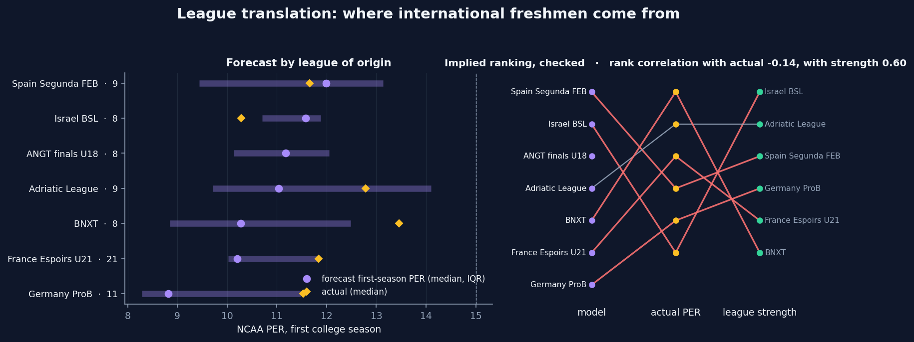
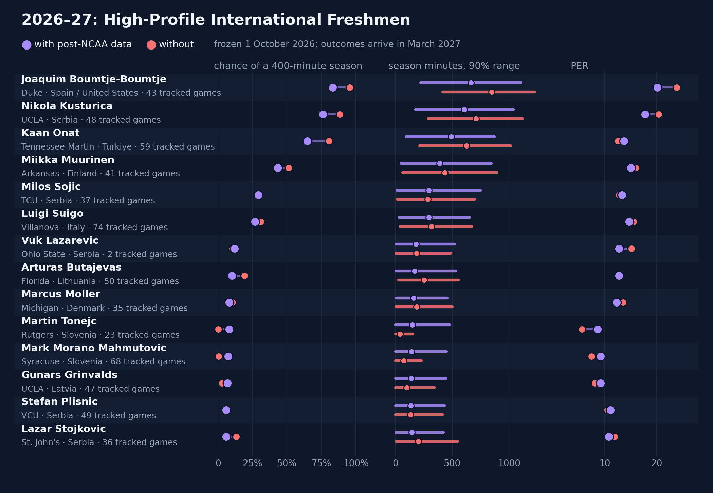

<p align="center">
  
</p>

<h1 align="center">Future Proves Past</h1>
<p align="center"><b>Learn backward. Predict forward.</b><br>
Forecasting the first NCAA season of international recruits from their pre-college games,<br>
trained with the help of 10,000+ former NCAA players who later played abroad.</p>

<p align="center">
  
  
  
  <a href="#replicate-the-abstract"></a>
  
</p>

<div align="center">
<table>
  <tr>
    <td align="center" width="200"><h2>5.7×</h2>2021–22<br><sub>held-out season</sub></td>
    <td align="center" width="200"><h2>2.3×</h2>2022–23<br><sub>held-out season</sub></td>
    <td align="center" width="200"><h2>1.5×</h2>2025–26<br><sub>registered one-shot test</sub></td>
  </tr>
</table>
<sub>How many times more probable the seasons that actually happened were, under the model that learned from former players' later careers.</sub>
</div>

<p align="center">
  <a href="#the-idea-in-thirty-seconds"><b>The idea</b></a> &nbsp;·&nbsp;
  <a href="#does-learning-backward-help"><b>The evidence</b></a> &nbsp;·&nbsp;
  <a href="#forecasts-for-202627"><b>2026–27 forecasts</b></a> &nbsp;·&nbsp;
  <a href="#replicate-the-abstract"><b>Replicate</b></a>
</p>

<p align="center">The data and saved models behind the SSAC27 abstract, with step-by-step replication instructions, are under <a href="#replicate-the-abstract">Replicate the abstract</a>.</p>

---

## The idea in thirty seconds

College programs commit roster spots and money to international prospects before those players have played a single NCAA game. The data that would tell you how a Serbian junior league or the U18 EuroBasket translates to the Big 12 is thin: a few hundred players a decade ago, 113 experienced entrants in 2025–26.

But the *reverse* transition is huge. More than ten thousand former NCAA players went on to play in international leagues and for national teams, and every one of them is measured on both sides of the same gap: we know their college seasons, and we know what they did abroad.

So we train one network on two jobs. **Forward:** pre-college games → the coming NCAA season. **Backward:** post-college games → the college season we already know. The second job is only there to teach the first.



A worked example from the paper. A forward example takes a prospect's games at about age 19 and predicts the NCAA season that opens when he is 20: the history sits one year *before* the target. A reconstruction example takes a former player's games at about age 23 and reconstructs that same season at 20: the history sits three years *after* it. Age and signed time tell the network which job it is doing; the reconstruction example needs no pre-college history at all, which is why the large population of former players can teach it. The paper's three questions follow directly:

1. Does including post-NCAA international and national-team game histories improve forward freshman forecasts through shared parameters?
2. Which targets benefit: playing opportunity, production rates, or shooting efficiency?
3. Do any gains extend to freshmen with no recorded international or national-team experience?

The picture at the top shows what the answer to the first question buys. Red is a control model trained the ordinary way; purple is the same architecture trained with the former players' later careers; the gold line is what actually happened. Tomislav Buljan's season at New Mexico was twenty million times more probable under the purple model.

## What it predicts

Not a number. A **whole season as a probability distribution**: whether the player appears at all, games and starts, minutes, and thirteen box-score counts (field goals by zone, free throws, rebounds, assists, steals, blocks, turnovers, fouls), everything coupled through an explicit opportunity-before-production structure. From draws of that distribution we read off anything a scout asks for: P(400+ minutes), minutes per game *if he plays*, PER, usage, true shooting, per-40 rates.

Inputs are every tracked game before the season's cutoff (1 October): 6.3 million player-games from 160 international leagues (151 club competitions with games in the tables), 78 national-team competitions and the main US showcases, each game encoded with its box score, opponent strength, competition, age group, the player's age that day and a handful of clocks; plus static context (bio, recruiting rank, destination team).

## How it works

<p align="center">
  
</p>

The reference tower does three things. It **encodes each game** into a vector with one small shared network. It **summarizes the history** with fixed weights, an exposure-weighted long-run mean and a recency-weighted recent mean, plus the contrasts between them, so established performance and recent form are both visible, and attaches evidence about how much history there is. It **combines** that summary with the destination context, the player's age and the signed time to the target, and maps the result to the parameters of the season distribution. International games and any prior NCAA games get separate summaries. There is no learned attention, the tower has 57,363 parameters, and a game that happened after the target is simply never shown to a forward example.

The backward task updates exactly the parts a forward forecast uses: the game encoder, the fusion networks, the translator and the outcome heads. That shared path is what the experiments measure. Dates do the rest. A forward example sees only games dated before the season and released by its cutoff; a reconstruction example sees only games dated after that season ended. Nothing fitted, not even the feature standardization, may use a record released after the training cutoff.

## Does learning backward help?

<p align="center">
  
</p>

Every comparison is paired on the same players, scored by the log probability the model assigns to the season that happened, with a **strict control** that never sees a game dated after a player's first college season. Rolling folds, dated cutoffs, one registered one-shot test.

> [!NOTE]
> Every season shown is out of sample. Each row's models were trained only on seasons before the one scored, every input game was released before the forecast cutoff, and the 2025–26 comparison was registered before that season was scored.

| Freshmen with international, national-team or showcase games | Gain, nats per player [95% CI] | Probability ratio | Share improved |
|---|---|---|---|
| 2021–22, held out (n 105) | **+1.75** [+0.85, +2.64] | 5.7× | 67% |
| 2022–23, held out, two fits averaged (n 124) | **+0.85** [+0.34, +1.36] | 2.3× | 59% |
| 2025–26, registered test, two fits averaged (n 307) | **+0.39** [+0.10, +0.68] | 1.5× | 50% |

The probability ratio is e^gain: the seasons that actually happened were that many times more probable, as a geometric mean over players, under the model that learned backward. Bold marks a 95% interval above zero. Each fit separately: 2022–23 +0.84 [+0.18, +1.50] and +0.86 [+0.31, +1.41]; 2025–26 +0.26 [−0.12, +0.64] for the registered primary fit and +0.52 [+0.16, +0.88] for the replication fit. The held-out cohorts are players with international or national-team games; the test cohort also counts the 23 freshmen whose only tracked games are US showcases. On the test, the continuous ranked probability score (CRPS) improves by 6–8% for season minutes, points, rebounds and assists (right panel).

<details>
<summary><b>Terms used on this page</b></summary>

- **Log score, in nats.** The log of the probability a model gave to the season that actually happened. A gain of +1 nat per player means the actual seasons were e ≈ 2.7 times more probable, on average.
- **Probability ratio.** e^gain: the geometric mean, over players, of how many times more probable the actual season was under the full model than under the control.
- **CRPS.** The continuous ranked probability score: the expected distance between a forecast distribution and the value that happened, in the statistic's own units; lower is better. Skill is the share of the control's CRPS that the full model removes.
- **Strict control.** The same model trained without any game dated after a player's first college season, so it never learns from later careers.
- **Held-out season.** A season scored once, by models trained only on earlier seasons. The **registered test**, 2025–26, had its comparison and metrics written down before it was scored.
- **Fit.** One training run with one random seed. 2022–23 and 2025–26 were each fitted twice; the rows above average the two.

</details>

### Things the abstract had no room for

The points on the loss weight, first-season labels, re-weighting and the 793-player holdout come from robustness runs that are not part of the release; the rest can be checked against it.

- **The gain is a breakout detector.** Per-player gains are heavy-tailed: in 2022–23 the ten largest cases carry 89% and 77% of the summed gain in the two fits (mean +0.84 → +0.10 and +0.86 → +0.22 without them), and 69% in 2021–22. The median player gains a modest 1.2–1.7× in probability. What the auxiliary data buys is the ability to take seriously the international freshman who becomes a real contributor, which the control treats as near-impossible.
- **Where the gain lives.** On the held-out seasons most of it is *production given playing time* (+1.26, +0.63 and +0.76 nats, every interval above zero); playing time adds less (+0.49 in 2021–22; +0.22 and +0.10 in 2022–23, intervals crossing zero), and shooting percentages almost nothing. On the registered test the balance shifted toward playing time (replication fit: +0.33 against +0.19 for production). Freshmen without any international or national-team history do not benefit: a small loss on the held-out seasons (−0.08 to −0.10 nats, intervals below zero) and no difference on the test (−0.04 and −0.01).
- **Against the recruiting industry.** On the registered 2025–26 test the full model's rank correlation with realized minutes was 0.40–0.43 against 0.23 for the 247Sports composite, with points 0.43–0.46 against 0.28, and its AUC for identifying 400-minute contributors 0.69–0.72 against 0.61 (all 307 players; recruits without a composite rank are placed last, ties broken by height).
- **How much more auxiliary signal is there?** Tripling the weight of the backward task changed nothing (−0.03 [−0.32, +0.26]). Re-weighting training toward first seasons helps the big no-history cohort (+0.05 to +0.23 nats) and is neutral for the history cohorts. The next gains will come from architecture and data coverage, not from the loss.
- **The ranking power is the system's; the paired gain is the data's.** The strict control also beats the 247Sports composite at ranking (rank correlation with minutes 0.37, with points 0.41–0.42, AUC 0.68–0.69). What the former players' careers add shows up in the probability assigned to whole seasons, not in a reshuffled ranking.
- **Every college season is a teacher.** Restricting every training label, forward and backward, to first seasons (in both arms) shrinks the paired gains to +0.21, +0.12 and −0.09 nats. Later college seasons supply three times as many reconstruction labels (26,029 against 7,849 on one fold) and sit closer in time to the professional careers.
- **Careers are long.** The median post-college game lies 7.6 years after the player's first NCAA season; a four-year window after college would discard 89% of them. The model uses every later season available at the training cutoff.
- **The translation is real on unseen players.** On 793 former players held out entirely, predicting their known college seasons from their later careers alone beats an intercept-only model by 7.4 nats per season, 4.5 on freshman seasons.

<p align="center">
  
</p>

**Hall of breakouts, 2025–26** (how many times more probable the full model found the actual season): Tomislav Buljan, New Mexico, ×20 million · Ilias Kamardine, Ole Miss, ×158,000 · Tim Rudovskii, Bryant, ×21,000 · Dylan Ducommun, Northern Illinois, ×8,200 · Thijs De Ridder, Virginia, ×5,200 · Filip Brankovic, Texas-RGV, ×3,500. The ladder above is every international entrant of that season, not just the winners: 47% improved, median ×0.94.

## Where freshmen come from, and how production travels

<p align="center">
  
</p>

The model's ranking of leagues by forecast first-season PER tracks an independent measure of league strength, the cross-league RAPM calibration (rank correlation 0.55). Realized PER by league, at about ten players a league, is too noisy to confirm or refute it (rank correlation −0.09). A second check uses the former players directly: the production ratio each league implies from the players who *left* college for it, against the ratio the model *applies* to players arriving from it, agree with rank correlation 0.79 across the seven best-covered leagues.

There is a formal version of this. Projecting the fitted model onto standardized player profiles over a declared reference population yields an NCAA-equivalent translation rule for each statistic: an exchange rate from production in a league to implied NCAA production. Under a multiplicative form those rates act as league difficulties, so a composite such as PER would order the leagues on one NCAA scale. Any such ordering is model-implied and specific to a target, a population and a horizon, not a causal league effect; the figure above is a first empirical look, not the finished analysis.

## What it does not claim

**Reverse history is not a new idea; the controlled test is the contribution.**

| | Prior work | This project |
|---|---|---|
| **Translating across leagues** | Glazer's G League-to-NBA translation factors (matching and difference-in-differences); Penner's 22,500 players across 110 leagues | Translation learned inside one network, from former players measured on both sides of the gap |
| **Recruiting international players** | Practitioner models: Kalinowski's Recruit Points, The Resource Nexus, QuantCat (a prospect compared with former NCAA players of similar overseas dominance); Held's freshman-impact poster | A forecast of the whole first season as a probability distribution |
| **Validation** | The practitioner models are published as method descriptions, not validated benchmarks | A strict control, dated cutoffs and a registered one-shot test season, with the gain decomposed by target and cohort |

- **Later careers alone cannot identify the forward mapping.** Professionals and incoming recruits differ in age, selection, role and competition. Signed time and age let the model represent those differences; they do not erase them, which is why forward labels and forward validation stay essential and why a zero-weight comparator is always run.
- **Opportunity is the hard part.** A freshman's minutes depend on a roster that is only partly known before arrival. Prior team ratings and returning-production shares describe the destination; they do not allocate its minutes. That is why the exhibits show efficiencies, and why minutes forecasts carry wide intervals.
- **A probabilistic output is not automatically calibrated.** Interval coverage and the calibration of the rotation probabilities are empirical checks, still being run, not consequences of the model's form.
- **Coverage drifts.** Date of birth is missing for 27% of eligible player-seasons in 2017–18 and 72% in 2025–26 (international entrants: at most 3% in any season); starter flags on international games went from 56% to 100% coverage in the current data build. Masks and evidence features carry the known share, but a mask does not remove the shift.

## Forecasts for 2026–27

The prospective cohort is every 2026–27 freshman in his first NCAA roster season for whom the model has at least one tracked pre-college game: **282 players**, 220 of them international. By history: 141 club and national team, 47 club only, 69 national team only, 25 US showcase only. Median history: 28 tracked games; a quarter have 74 or more.

> [!IMPORTANT]
> These forecasts were frozen on 1 October 2026, before the season, and will be scored when it ends in March 2027. They are a commitment, not a validation.

All 282 were forecast by the deployment models: trained through 2024–25 plus half of the 2025–26 players and stopped on the other half, the two halves pooled; 2,000 simulated seasons per player, once with and once without the former players' careers in training. Minutes per game are conditional on appearing. The frozen files carry the run names and data digests.

<p align="center">
  
</p>

**High-profile international freshmen.** For the best-known arrivals the careers make the model more cautious about an immediate rotation role (Boumtje-Boumtje at Duke 0.95 → 0.83, Kusturica at UCLA 0.88 → 0.76) and slightly more hopeful for two Slovenians the control had written off (Tonejc at Rutgers and Morano Mahmutovic at Syracuse, from near zero to 0.07–0.08).

<details>
<summary><b>The numbers behind the figure</b></summary>

| Player | Team | Nationality | Tracked games | P(400+ min) with / without | Min/game if plays | PER with / without |
|---|---|---|---|---|---|---|
| Joaquim Boumtje-Boumtje | Duke | Spain / United States | 43 | 0.83 / 0.95 | 19.8 | 20.1 / 23.8 |
| Nikola Kusturica | UCLA | Serbia | 48 | 0.76 / 0.88 | 18.0 | 17.8 / 20.4 |
| Kaan Onat | Tennessee-Martin | Turkiye | 59 | 0.65 / 0.81 | 20.0 | 13.7 / 12.6 |
| Miikka Muurinen | Arkansas | Finland | 41 | 0.43 / 0.51 | 13.8 | 15.0 / 15.9 |
| Milos Sojic | TCU | Serbia | 37 | 0.29 / 0.28 | 11.5 | 13.3 / 12.8 |
| Luigi Suigo | Villanova | Italy | 74 | 0.27 / 0.31 | 12.0 | 14.7 / 15.6 |
| Vuk Lazarevic | Ohio State | Serbia | 2 | 0.12 / 0.10 | 8.2 | 12.7 / 15.1 |
| Arturas Butajevas | Florida | Lithuania | 50 | 0.10 / 0.19 | 7.8 | 12.7 / 12.8 |
| Marcus Moller | Michigan | Denmark | 35 | 0.08 / 0.10 | 7.7 | 12.3 / 13.5 |
| Martin Tonejc | Rutgers | Slovenia | 23 | 0.08 / 0.00 | 8.1 | 8.6 / 5.6 |
| Mark Morano Mahmutovic | Syracuse | Slovenia | 68 | 0.07 / 0.00 | 7.8 | 9.2 / 7.5 |
| Gunars Grinvalds | UCLA | Latvia | 47 | 0.07 / 0.03 | 7.1 | 9.2 / 8.1 |
| Stefan Plisnic | VCU | Serbia | 49 | 0.06 / 0.06 | 7.6 | 11.1 / 10.5 |
| Lazar Stojkovic | St. John's | Serbia | 36 | 0.06 / 0.13 | 7.0 | 10.8 / 11.9 |

</details>

**Where the former players' careers change the forecast most.** Across the cohort the two models agree about the typical player (mean P(400+ min) 0.275 with the careers against 0.267 without; international group mean PER 11.0 against 10.7). They disagree sharply about individuals, and the disagreements cluster where the backward task has the most to say: players with long club histories heading to mid-majors.

*Raised most by the careers:*

| Player | Team | History | Tracked games | P(400+ min) with / without | PER with / without |
|---|---|---|---|---|---|
| Talis Soulhac | Murray State | club + national | 153 | 0.73 / 0.02 | 13.3 / 7.1 |
| Siebe Ledegen | Ohio | club + national | 206 | 0.83 / 0.14 | 13.8 / 8.7 |
| Aurele Brena-Chemille | San Jose State | club + national | 177 | 0.94 / 0.32 | 15.1 / 11.2 |
| Cameron Williams | Duke | showcase only | 3 | 0.74 / 0.12 | 21.1 / 15.2 |
| Saliou Niang | LSU | club + national | 163 | 0.79 / 0.27 | 15.5 / 12.6 |
| Yoav Vitlem | San Francisco | club + national | 74 | 0.70 / 0.19 | 10.5 / 7.3 |
| Nemanja Popovic | Memphis | club + national | 175 | 0.82 / 0.32 | 16.3 / 13.6 |

*Lowered most by the careers:*

| Player | Team | History | Tracked games | P(400+ min) with / without | PER with / without |
|---|---|---|---|---|---|
| Kajus Mikalauskas | Texas-Arlington | club + national | 120 | 0.08 / 0.78 | 7.4 / 9.1 |
| Armandas Bancevicius | Tennessee-Martin | club + national | 126 | 0.16 / 0.79 | 11.5 / 14.6 |
| Gabrielius Jokubauskas | Northern Kentucky | club + national | 100 | 0.14 / 0.70 | 10.0 / 13.3 |
| Jamal George | Oral Roberts | club + national | 68 | 0.26 / 0.81 | 9.5 / 10.7 |
| Ogbemudia Uagboe | Cleveland State | club + national | 44 | 0.24 / 0.77 | 9.0 / 11.0 |

All 282 freshmen, with and without the careers side by side, are in `FORECASTS_2026_27_deploy_v11_pooled_WITH_WITHOUT.md` in the release (see [Replicate the abstract](#replicate-the-abstract)); the per-model files with intervals are `FORECASTS_2026_27_deploy_v11_pooled.md` and `FORECASTS_2026_27_deploy_control_v11_pooled.md`. The PER shown here is the rate forecast from `FORECAST_RATES_2026_27_deploy_v11_pooled.md`. The cohort list is [`data/forecast_2027_cohort.csv`](data/forecast_2027_cohort.csv).

## How the experiment is run

- **Prediction unit.** A player's season with one team. Target: the season as drawn above; the schedule length is a labeled condition, never an input.
- **Rolling folds.** Fold *v* trains on seasons through *v*−2, chooses its stopping epoch on *v*−1, and scores *v* once. Development 2019–20 to 2022–23; selection 2023–24 and 2024–25; **registered one-shot test 2025–26**; deployment 2026–27. The paired comparisons with the strict control were run on the two most recent development folds, 2021–22 and 2022–23.
- **Cross-stopping for deployment.** The last labeled season is split into two fixed halves; one model trains on everything plus half 1 and stops on half 0, the second the reverse; the forecast is their mixture. The registered test used no cross-stopping: its models trained through 2023–24 and stopped on 2024–25, and 2025–26 entered nothing until it was scored. Only then did it become the last labeled season for deployment.
- **Arms.** `A` forward only; `AR` forward plus the backward task on the former players' careers; the strict control `A⁻` additionally never sees a game dated after a player's first college season, in any input, pool or window. Against the ordinary arm `A`, which keeps those later games as inputs but has no backward task, the full model gains +1.60 [+0.70, +2.50] in 2021–22 and +0.01 [−0.47, +0.50] and +0.73 [+0.19, +1.27] in the two 2022–23 fits.
- **Scoring.** Marginal log probability of the observed season, overtime summed out, verified against a quadrature with twice the nodes; paired differences with player-level standard errors; every comparison on identical units.
- **Reproducibility.** Write-once run manifests with the training curve, SHA-256 of the tables and the test registration; the one-shot test was registered before it was scored.

The reference tower has 57,363 parameters and trains in about fourteen minutes an epoch on a laptop CPU; it stops after ten to twenty epochs.

## What is in this repository

| Path | What |
|---|---|
| `fpp/data` | Dated data contracts: calendars and cutoffs, immutable game records, nested reconstruction windows, routing of games and summaries, rolling folds, the table assembler over the upstream stores |
| `fpp/model` | The season distribution and its observed-data likelihood (NumPy/SciPy reference and a differentiable PyTorch twin), feature construction, the game tower, pooling, heads |
| `fpp/experiments` | Training and scoring of one arm on one fold, fold reports, intercept-only recovery |
| `tests/` | 197 tests: likelihood identities, cutoff and leakage guards, strict-control masks, weighting, cross-stopping, every architecture option reproducing the registered model by default |
| `config/protocol.json` | The calendar, cutoffs, fold layout and numerical tolerances the code enforces. Its arm letters and four-year reconstruction horizon are the original design; the recipe actually compared (the full model against the strict control, every later season, two fits) is fixed in `TEST_REGISTRATION_2026.md` in the release |
| `replication/` | Frozen scoring scripts, the NCAA team totals and PER constants they read, the abstract source and its figure scripts, the script behind the 2026–27 figure above, and the archive checksums |
| `data/` | The 2026–27 forecast cohort |
| `assets/` | The figures shown here |

Not in the repository: the upstream game databases (built from public box scores), the paper source, and the local run scripts. The assembled tables those databases produce, and the saved models, are attached to a release (see [Replicate the abstract](#replicate-the-abstract)).

## Run it

```sh
python -m venv .venv && . .venv/bin/activate
python -m pip install -e ".[model,data,dev]"
python -m pytest tests -q                      # 197 tests, about two minutes
fpp smoke --out artifacts/smoke.json --draws 200 --score-first 3     # synthetic seasons, no data needed
fpp gradcheck --out artifacts/gradcheck.json                          # differentiable likelihood vs the reference
```

With the upstream stores available (read-only; the assembler never writes to them):

```sh
fpp build-tables --stores stores.json --out cache/tables_v11
fpp train --tables cache/tables_v11 --fold 2023 --arm AR --lambda-plus 1 --seed 20260901 \
          --out cache/runs/ARfull_2023 --recon-horizon-years none --recon-k 1,2,3,all
fpp train --tables cache/tables_v11 --fold 2023 --arm A --exclude-post-first-season-logs \
          --seed 20260901 --out cache/runs/control_2023
fpp report-run --run cache/runs/ARfull_2023 --compare cache/runs/control_2023 --tables cache/tables_v11
```

Useful flags: `--cross-stop 0|1` and `--weighting season_balanced --first-year-share 0.5`; `fpp train --help` lists the rest. The architecture defaults reproduce the registered tower; the full model also takes `--recon-horizon-years none --recon-k 1,2,3,all`, as above.

## Replicate the abstract

Everything behind the SSAC27 abstract runs from flat files; no database is needed. The data and the saved models are attached to the GitHub release `ssac27-abstract` as four zip archives (about 475 MB in all), with SHA-256 sums in [`replication/SHA256SUMS`](replication/SHA256SUMS):

| Archive | Contents |
|---|---|
| `tables_v7.zip` | The assembled tables behind every number in the abstract: `games.parquet` (6,317,405 player-game lines, 73 columns), `units.parquet` (124,618 player-seasons, 82 columns), competition periods and the manifest whose hashes the code verifies. |
| `tables_v11.zip` | The deployment tables behind the 2026–27 forecasts above (6,561,231 lines, 97 columns), with the player, prior-league, destination-context, recruiting-rank and international-RAPM tables the deployment forecasts read. |
| `runs_registered.zip` | The ten registered run directories, named `bc_ARfull_l1_<fold>_<seed>` (full model) and `bc_Aexcl_l0_<fold>_<seed>` (strict control) for folds 2022, 2023 and 2026 and seeds 20260901 and 20260902 (2022: the first seed only), with checkpoints, per-unit scores and per-player prediction tables; and the four 2026–27 deployment runs, `bc_deployARfull_v11_l1_2027_<seed>` and `bc_deployAexcl_v11_l0_2027_<seed>`. |
| `results_docs.zip` | The result files behind the abstract and this page, with their per-unit CSVs: `FIRST_RESULT_*`, `TEST_RESULTS_2026`, `TEST_IDENTIFICATION_2026_*`, `TEST_REGISTRATION_2026`, `CRPS_*`, `FORECASTS_2026_27_*` and `FORECAST_RATES_2026_27_*`. |

The tables hold per-game box-score lines and the player fields as they appear on public roster and federation sites (name, date of birth, nationality, height, weight, position); no contact, financial or medical fields. `replication/scripts/` holds the scoring scripts frozen as of the abstract; `replication/data/` holds the NCAA team totals and PER constants those scripts previously read from a database; `replication/abstract/` holds the abstract source and its figure scripts. Tested with Python 3.14.6, torch 2.11.0, pandas 3.0.2, NumPy 2.4.4, SciPy 1.17.1, pyarrow 23.0.1 and matplotlib 3.10.8, on CPU.

```sh
# 0. Install (see Run it), then fetch, verify and unpack the archives
mkdir -p cache out
for f in tables_v7 tables_v11 runs_registered results_docs; do
  curl -fL -o cache/$f.zip https://github.com/aaronjdanielson/future_proves_past/releases/download/ssac27-abstract/$f.zip
done
(cd cache && shasum -a 256 -c ../replication/SHA256SUMS && unzip -q -o tables_v7.zip && unzip -q -o tables_v11.zip \
   && unzip -q -o runs_registered.zip && unzip -q -o results_docs.zip -d ../docs)

# 1. Paired log scores from the saved checkpoints: exact, a few minutes per pair, no training
python3 replication/scripts/first_result.py --tables cache/tables_v7 \
    --with cache/runs/bc_ARfull_l1_2023_20260901 --without cache/runs/bc_Aexcl_l0_2023_20260901 \
    --label "full model vs strict control, 2022-23, fit 1" --out out/FIRST_RESULT_2023_s1.md

# 2. CRPS by statistic and the test season's log score (300 season draws per run and player; about five minutes)
python3 replication/scripts/crps_forecasts.py --tables cache/tables_v7 \
    --with cache/runs/bc_ARfull_l1_2026_20260902 --without cache/runs/bc_Aexcl_l0_2026_20260902 \
    --cohort primary --n-draws 300 --label "2025-26 test, fit 2" --out out/CRPS_2026_s2.md

# 3. Ranking the test freshmen against the 247Sports composite
python3 replication/scripts/identification.py --tables cache/tables_v7 \
    --predictions cache/runs/bc_ARfull_l1_2026_20260901/per_player_predictions_vs_Aexcl.csv \
    --label "fit 1" --out out/TEST_IDENTIFICATION_s1.md

# 4. Retrain a pair from scratch with the registered recipe (CPU, hours per run); fold 2026 adds
#    --test-registration docs/TEST_REGISTRATION_2026.md
fpp train --tables cache/tables_v7 --fold 2023 --arm AR --lambda-plus 1 --seed 20260901 \
          --recon-horizon-years none --recon-k 1,2,3,all --out cache/runs/my_ARfull_2023
fpp train --tables cache/tables_v7 --fold 2023 --arm A --exclude-post-first-season-logs \
          --seed 20260901 --out cache/runs/my_control_2023

# 5. The abstract's evidence figure, from the per-unit CRPS files in docs/ (needs matplotlib)
python -m pip install matplotlib
(cd replication/abstract && python3 make_evidence_crps_figure.py --docs ../../docs --show-training)

# 6. The 2026–27 figure on this page, from the frozen forecast files
python3 replication/readme/make_forecast_figure.py --docs docs --out out
```

What to expect (the registered values; Monte Carlo steps reproduce to the precision of their draws):

| Quantity | Value | File in `results_docs.zip` |
|---|---|---|
| 2021–22, joint log-score gain, freshmen with history (n 105) | +1.747 [+0.849, +2.644] nats, 5.74× | `FIRST_RESULT_ARfull_vs_Aexcl_2022.md` (gain), `CRPS_2022_s1_history.md` (ratio) |
| 2022–23, fit 1 (n 124) | +0.842 [+0.182, +1.502], 2.32× | `FIRST_RESULT_ARfull_vs_Aexcl_2023.md`, `CRPS_2023_s1_history.md` |
| 2022–23, fit 2 | +0.862 [+0.310, +1.415], 2.37× | `FIRST_RESULT_ARfull_vs_Aexcl_2023_s2.md`, `CRPS_2023_s2_history.md` |
| 2025–26 test, primary and replication fits (n 307) | +0.26 [−0.12, +0.64] and +0.52 [+0.16, +0.88]; averaged +0.39 [+0.10, +0.68], 1.5× | `TEST_RESULTS_2026.md`, `CRPS_TEST_2026_s*_primary.md` |
| 2025–26 test, CRPS skill for season minutes, points, rebounds, assists | fit 1: +7.5%, +4.9%, +4.2%, +5.2% (intervals include zero); fit 2: +9.4%, +7.0%, +8.5%, +9.3% (all above zero); averaged: +8.4%, +5.9%, +6.4%, +7.3% | `CRPS_TEST_2026_s*_primary.md` |
| 2025–26 test, Spearman with season minutes / AUC for 400 minutes | 0.40–0.43 / 0.69–0.72 (composite 0.23 / 0.61) | `TEST_IDENTIFICATION_2026_s*.md`, `TEST_RESULTS_2026.md` |
| Freshmen without such history | −0.08, −0.09 and −0.10 nats on the held-out seasons (intervals below zero); −0.04 and −0.01 on the test (intervals include zero) | the same `FIRST_RESULT_*` and `TEST_RESULTS_2026.md` |

The figure's rows average the two fits of a season player by player (`replication/abstract/figures/evidence_crps.csv` records every value plotted). Not covered by the release: the league and translation figures, which read the international RAPM and league databases, and the robustness runs noted under "Things the abstract had no room for".

## People

Aaron John Danielson (Department of Computer Science, The University of Texas at Austin), Denis Beausoleil, Hasan Alanam.
Contact: aaron.danielson@austin.utexas.edu

<details>
<summary><b>How to cite</b></summary>

```bibtex
@misc{danielson2026futureprovespast,
  title        = {Future Proves Past: Learning Backward to Forecast International {NCAA} Recruits},
  author       = {Danielson, Aaron John and Beausoleil, Denis and Alanam, Hasan},
  year         = {2026},
  howpublished = {\url{https://github.com/aaronjdanielson/future_proves_past}},
  note         = {Code, data and saved models}
}
```

</details>
