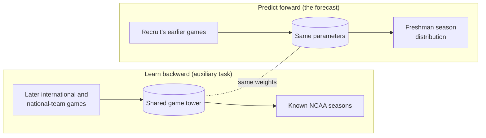
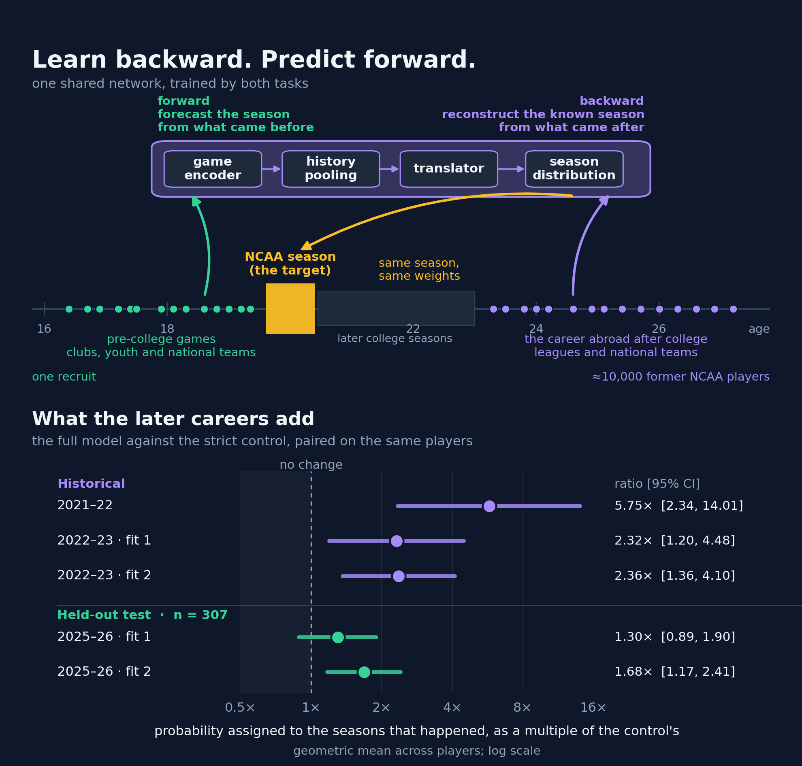

<p align="center">
  
</p>

<h1 align="center">Future Proves Past</h1>
<p align="center"><b>Learn backward. Predict forward.</b><br>
Forecasting the first NCAA season of international recruits from their pre-college games,<br>
trained with the help of 10,000+ former NCAA players who later played abroad.</p>

<p align="center">
  
  
  
  
</p>

---

## The idea in thirty seconds

College programs commit roster spots and money to international prospects before those players have played a single NCAA game. The data that would tell you how a Serbian junior league or the U18 EuroBasket translates to the Big 12 is thin: a few hundred players a decade ago, 113 experienced entrants in 2025–26.

But the *reverse* transition is huge. More than ten thousand former NCAA players went on to play in international leagues and for national teams, and every one of them is measured on both sides of the same gap: we know their college seasons, and we know what they did abroad.

So we train one network on two jobs. **Forward:** pre-college games → the coming NCAA season. **Backward:** post-college games → the college season we already know. The second job is only there to teach the first.



The picture at the top shows what that buys. Red is a control model trained the ordinary way; purple is the same architecture trained with the former players' later careers; the gold line is what actually happened. Tomislav Buljan's season at New Mexico was twenty million times more probable under the purple model.

## What it predicts

Not a number. A **whole season as a probability distribution**: whether the player appears at all, games and starts, minutes, and thirteen box-score counts (field goals by zone, free throws, rebounds, assists, steals, blocks, turnovers, fouls), everything coupled through an explicit opportunity-before-production structure. From draws of that distribution we read off anything a scout asks for: P(400+ minutes), minutes per game *if he plays*, PER, usage, true shooting, per-40 rates.

Inputs are every tracked game before the season's cutoff (1 October): 6.3 million player-games from 151 international club competitions, 78 national-team competitions and the main US showcases, each game encoded with its box score, opponent strength, competition, age group, the player's age that day and a handful of clocks; plus static context (bio, recruiting rank, destination team).

## Does learning backward help?

<p align="center">
  
</p>

Every comparison is paired on the same players, scored by the log probability the model assigns to the season that happened, with a **strict control** that never sees a game dated after a player's first college season. Rolling folds, dated cutoffs, one registered one-shot test.

| Freshmen with international or national-team history | Gain, nats per player (95% CI) | Share improved |
|---|---|---|
| 2021–22 (n 105) | **+1.75** [+0.85, +2.64] | 67% |
| 2022–23, seed 1 (n 124) | **+0.84** [+0.18, +1.50] | 56% |
| 2022–23, seed 2 (n 124) | **+0.86** [+0.31, +1.41] | 64% |
| 2025–26, registered test, two fits (n 307) | +0.26 [−0.12, +0.64], **+0.52** [+0.16, +0.88] | 47% |

A gain of +0.84 nats means the realized seasons were, on average, e^0.84 ≈ 2.3× more probable under the model that learned backward.

### Things the abstract had no room for

- **The gain is a breakout detector.** Per-player gains are heavy-tailed: the ten largest cases carry 99% of the summed gain in 2022–23 (mean +0.82 → +0.01 without them). The median player gains a modest 1.2–1.6× in probability. What the auxiliary data buys is the ability to take seriously the international freshman who becomes a real contributor, which the control treats as near-impossible.
- **Where the gain lives.** Almost all of it is *production given playing time*. Shooting percentages: no gain. Minutes and starts: no gain. Freshmen without any international or national-team history: no gain (−0.05 to +0.06). The careers abroad teach how production translates, not who the coach will play.
- **Against the recruiting industry.** On the registered 2025–26 test the full model's rank correlation with realized minutes was 0.40–0.43 against 0.23 for the 247 composite, with points 0.43–0.46 against 0.28, and its AUC for identifying 400-minute contributors 0.69–0.72 against 0.61.
- **How much more auxiliary signal is there?** Tripling the weight of the backward task changed nothing (−0.03 [−0.32, +0.26]). Re-weighting training toward first seasons helps the big no-history cohort (+0.05 to +0.23 nats) and is neutral for the history cohorts. The next gains will come from architecture and data coverage, not from the loss.

<p align="center">
  
</p>

**Hall of breakouts, 2025–26** (how many times more probable the full model found the actual season): Tomislav Buljan, New Mexico, ×20,288,508 · Ilias Kamardine, Ole Miss, ×157,737 · Tim Rudovskii, Bryant, ×20,982 · Dylan Ducommun, Northern Illinois, ×8,189 · Thijs De Ridder, Virginia, ×5,142 · Filip Brankovic, Texas-RGV, ×3,507. The ladder above is every international entrant of that season, not just the winners: 47% improved, median ×0.94.

## Where freshmen come from, and how production travels

<p align="center">
  
</p>

The model's ranking of leagues by forecast first-season PER tracks an independent measure of league strength, the cross-league RAPM calibration (rank correlation 0.60). Realized PER by league is noisy at ten players a league. A second check uses the former players directly: the production ratio each league implies from the players who *left* college for it, against the ratio the model *applies* to players arriving from it, agree with rank correlation 0.79 across the seven best-covered leagues.

## Forecasts for 2026–27

The prospective cohort is every 2026–27 freshman in his first NCAA roster season for whom the model has at least one tracked pre-college game: **282 players**, 220 of them international. By history: 141 club and national team, 47 club only, 69 national team only, 25 US showcase only. Median tower: 28 games; a quarter have 74 or more.

The full-cohort forecasts come from the deployment models retrained on 2026-10-01 and are published here as they freeze. Below, the first thirty-five players of interest, frozen 2026-09-30 from the previous deployment models (two seeds pooled, 2,000 simulated seasons per player; minutes per game conditional on appearing; PER over seasons with 100+ minutes). Treat them as a commitment, not a validation: the outcomes arrive in March.

**Most anticipated** (by probability of a 400-minute rotation season):

| Player | Team | Tracked games | 247 rank | P(400+ min) | Min/game if plays | PER |
|---|---|---|---|---|---|---|
| Tyran Stokes | Kansas | 23 | 1 | 0.99 | 31.8 | 23.8 |
| Caleb Holt | Arizona | 22 | 4 | 0.99 | 30.5 | 20.2 |
| Jordan Smith Jr. | Arkansas | 16 | 3 | 0.99 | 29.6 | 18.8 |
| Christian Collins | USC | 3 | 6 | 0.97 | 29.6 | 20.0 |
| Brandon McCoy Jr. | Michigan | 22 | 14 | 0.96 | 26.6 | 17.2 |
| Bruce Branch III | BYU | 8 | 8 | 0.96 | 25.6 | 19.2 |
| Kaan Onat | UT Martin | 59 | — | 0.59 | 22.1 | 14.2 |
| Miikka Muurinen | Arkansas | 41 | 32 | 0.57 | 16.3 | 17.3 |

The model is bullish on the top American recruits' minutes and, for most of this year's international freshmen, expects a bench role with average-to-good efficiency when they do play. Onat (UT Martin) and Muurinen (Arkansas) are the two internationals it expects in a rotation.

<details>
<summary><b>All thirty-five players of interest</b> (frozen 2026-09-30, previous deployment models)</summary>

| Player | Team | Tracked games | 247 rank | P(400+ min) | Min/game if plays | PER |
|---|---|---|---|---|---|---|
| *USA Basketball history* | | | | | | |
| Tyran Stokes | Kansas | 23 | 1 | 0.99 | 31.8 | 23.8 |
| Caleb Holt | Arizona | 22 | 4 | 0.99 | 30.5 | 20.2 |
| Jordan Smith Jr. | Arkansas | 16 | 3 | 0.99 | 29.6 | 18.8 |
| Brandon McCoy Jr. † | Michigan | 22 | 14 | 0.96 | 26.6 | 17.2 |
| Bruce Branch III | BYU | 8 | 8 | 0.96 | 25.6 | 19.2 |
| Taylen Kinney | Kansas | 7 | 18 | 0.96 | 27.5 | 13.6 |
| Caleb Gaskins | Miami (FL) | 6 | 13 | 0.93 | 24.6 | 17.8 |
| Jasiah Jervis | Michigan State | 6 | 26 | 0.86 | 22.5 | 13.9 |
| Colben Landrew | UConn | 6 | 24 | 0.78 | 20.0 | 15.3 |
| Ethan Taylor | Michigan State | 6 | 30 | 0.44 | 13.8 | 17.7 |
| *US showcases only* | | | | | | |
| Christian Collins | USC | 3 | 6 | 0.97 | 29.6 | 20.0 |
| JJ Andrews | Arkansas | 2 | 16 | 0.95 | 24.5 | 18.0 |
| Jason Crowe Jr. | Missouri | 3 | 7 | 0.88 | 26.7 | 15.7 |
| Anthony Thompson | Ohio State | 1 | 9 | 0.84 | 22.1 | 17.3 |
| Cameron Williams | Duke | 3 | 2 | 0.54 | 16.3 | 18.3 |
| Deron Rippey Jr. | Duke | 2 | 10 | 0.41 | 13.6 | 12.3 |
| Bryson Howard | Duke | 1 | 12 | 0.33 | 12.4 | 11.9 |
| *International club and national teams* | | | | | | |
| Kaan Onat | UT Martin | 59 | — | 0.59 | 22.1 | 14.2 |
| Miikka Muurinen | Arkansas | 41 | 32 | 0.57 | 16.3 | 17.3 |
| Nikola Kusturica | UCLA | 48 | — | 0.42 | 14.4 | 15.4 |
| Luigi Suigo | Villanova | 74 | — | 0.29 | 13.0 | 16.2 |
| Lukas Bojovic | Wake Forest | 35 | — | 0.28 | 12.7 | 10.6 |
| Joaquim Boumtje-Boumtje | Duke | 43 | — | 0.26 | 11.8 | 15.9 |
| Ilia Frolov | Arkansas | 27 | — | 0.20 | 11.4 | 14.0 |
| Juwan Ekanga-Ehawa | Gonzaga | 77 | — | 0.16 | 10.5 | 12.1 |
| Milos Sojic | TCU | 37 | — | 0.10 | 9.2 | 12.6 |
| Arturas Butajevas | Florida | 50 | — | 0.09 | 8.3 | 13.3 |
| Gunars Grinvalds | UCLA | 47 | — | 0.09 | 8.2 | 8.9 |
| Mark Morano Mahmutovic | Syracuse | 67 | — | 0.08 | 8.8 | 9.7 |
| Marcus Moller | Michigan | 35 | — | 0.07 | 7.5 | 12.9 |
| Nolan Adekunle | Virginia | 185 | — | 0.05 | 7.3 | 8.9 |
| Martin Tonejc | Rutgers | 22 | — | 0.05 | 6.9 | 6.3 |
| Lazar Stojkovic | St. John's | 33 | — | 0.03 | 6.4 | 10.5 |
| Vuk Lazarevic | Ohio State | 2 | — | 0.02 | 5.7 | 11.3 |
| Stefan Plisnic | VCU | 49 | — | 0.01 | 4.7 | 9.2 |

† expected to miss 2026–27 (ACL); the forecast is conditional on playing.

</details>

**Coming to this table today:** the other 247 prediction-ready freshmen, among them Maxime Meyer (Duke, four Canadian youth national teams), Sinan Huan (Purdue, 5.0 blocks a game at the U19 World Cup), Gedeon Basson (Xavier), Amadou Seini (West Virginia, the U19 World Cup rebounding record), David Torresani (San Diego State, 60 games in Italy's top league) and Mantas Laurenčikas (Texas, Žalgiris and Monaco). Players whose only pre-college games are in leagues we have not scraped yet (Germany's NBBL, for one) join as the coverage grows.

## How the experiment is run

- **Prediction unit.** A player's season with one team. Target: the season as drawn above; the schedule length is a labelled condition, never an input.
- **Rolling folds.** Fold *v* trains on seasons through *v*−2, chooses its stopping epoch on *v*−1, and scores *v* once. Development 2019–20 to 2022–23; selection 2023–24 and 2024–25; **registered one-shot test 2025–26**; deployment 2026–27.
- **Cross-stopping for deployment.** The last labelled season is split into two fixed halves; one model trains on everything plus half 1 and stops on half 0, the second the reverse; the forecast is their mixture. The test season enters nothing.
- **Arms.** `A` forward only; `AR` forward plus the backward task on the former players' careers; the strict control `A⁻` additionally never sees a game dated after a player's first college season, in any input, pool or window.
- **Scoring.** Marginal log probability of the observed season, overtime summed out, verified against a quadrature with twice the nodes; paired differences with player-level standard errors; every comparison on identical units.
- **Reproducibility.** Write-once run manifests with the training curve, SHA-256 of the tables and the test registration; the one-shot test was registered before it was scored.

The reference tower has 57,363 parameters and trains in about fourteen minutes an epoch on a laptop CPU; it stops after ten to twenty epochs.

## What is in this repository

| Path | What |
|---|---|
| `fpp/data` | Dated data contracts: calendars and cutoffs, immutable game records, nested reconstruction windows, routing of games and summaries, rolling folds, the table assembler over the upstream stores |
| `fpp/model` | The season distribution and its observed-data likelihood (NumPy/SciPy reference and a differentiable PyTorch twin), feature construction, the game tower, pooling, heads |
| `fpp/experiments` | Training and scoring of one arm on one fold, fold reports, intercept-only recovery |
| `tests/` | 194 tests: likelihood identities, cutoff and leakage guards, strict-control masks, weighting, cross-stopping, every architecture option reproducing the registered model by default |
| `config/protocol.json` | The frozen experimental protocol: calendar, reconstruction horizon, fold layout, numerical tolerances |
| `assets/` | The figures shown here |

Not in the repository: the upstream game databases (built from public box scores; not redistributed), the paper source, and the local run scripts and decision log.

## Run it

```sh
python -m venv .venv && . .venv/bin/activate
python -m pip install -e ".[model,data,dev]"
python -m pytest tests -q                      # 194 tests, about two minutes
fpp smoke --out artifacts/smoke.json --draws 200 --score-first 3     # synthetic seasons, no data needed
fpp gradcheck --out artifacts/gradcheck.json                          # differentiable likelihood vs the reference
```

With the upstream stores available (read-only; the assembler never writes to them):

```sh
fpp build-tables --stores stores.json --out cache/tables_v11
fpp train --tables cache/tables_v11 --fold 2023 --arm AR --lambda-plus 1 --seed 20260901 \
          --out cache/runs/ARfull_2023 --recon-horizon-years none --recon-k 1,2,3,all
fpp train --tables cache/tables_v11 --fold 2023 --arm A --exclude-post-first-season-logs \
          --seed 20260901 --out cache/runs/control_2023
fpp report-run --run cache/runs/ARfull_2023 --compare cache/runs/control_2023 --tables cache/tables_v11
```

Useful flags: `--cross-stop 0|1`, `--weighting season_balanced --first-year-share 0.5`, `--feature-schema v9`, and the architecture options `--width`, `--hidden`, `--direction-film`, `--attention-pool`, `--head-hidden`, `--game-dropout`, `--average-last`, `--lr-decay`, `--future-weight`. Defaults reproduce the registered model exactly.

## Status

- **Paper:** *Future Proves Past: Using Post-NCAA Careers Abroad to Forecast Incoming International Recruits*, in revision.
- **MIT Sloan Sports Analytics Conference 2027:** research paper competition abstract, October 2026.
- **2026–27:** deployment forecasts for the 282-player cohort, dated and frozen; scored when the season ends.
- **Next:** cross-stopping and architecture ladders (attention pooling, two-layer heads, learning-rate decay), the v9 feature blocks (prior league, usage, destination context, international RAPM), youth-league coverage.

## People

Aaron John Danielson (Department of Computer Science, The University of Texas at Austin), Denis Beausoleil, Hasan Alanam.
Contact: aaron.danielson@austin.utexas.edu
